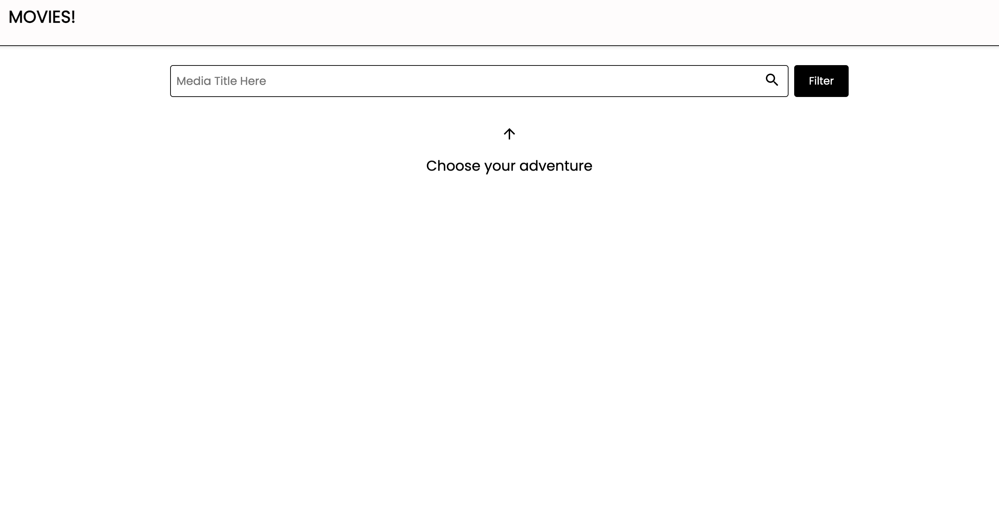
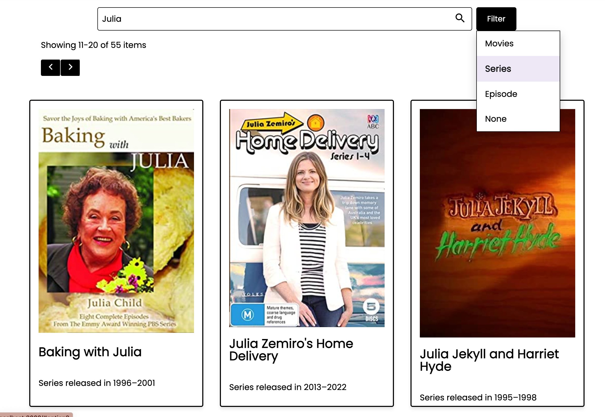
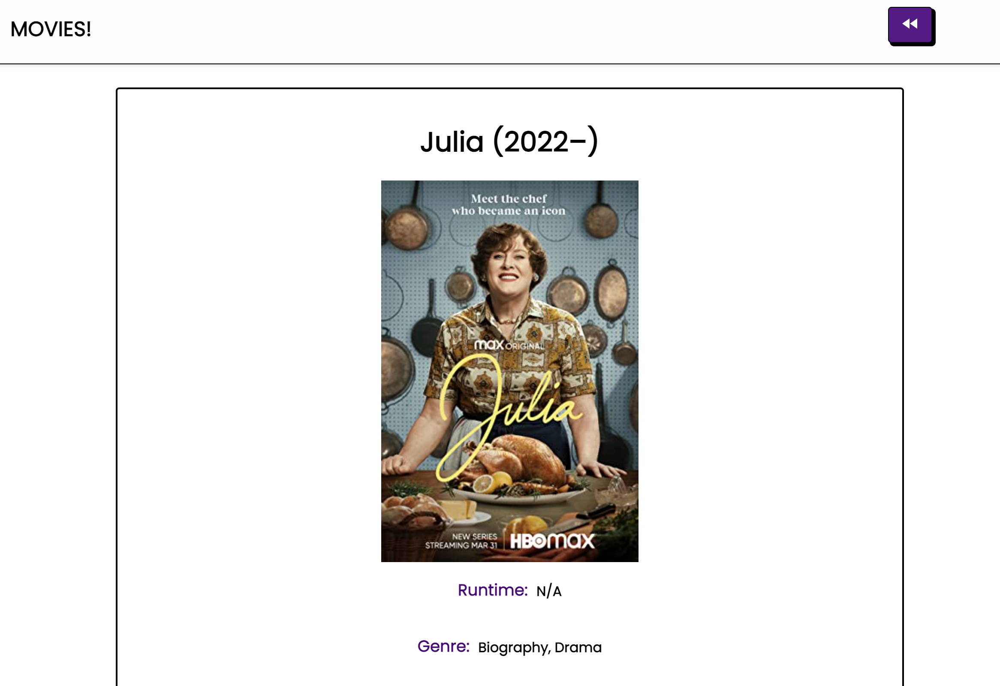
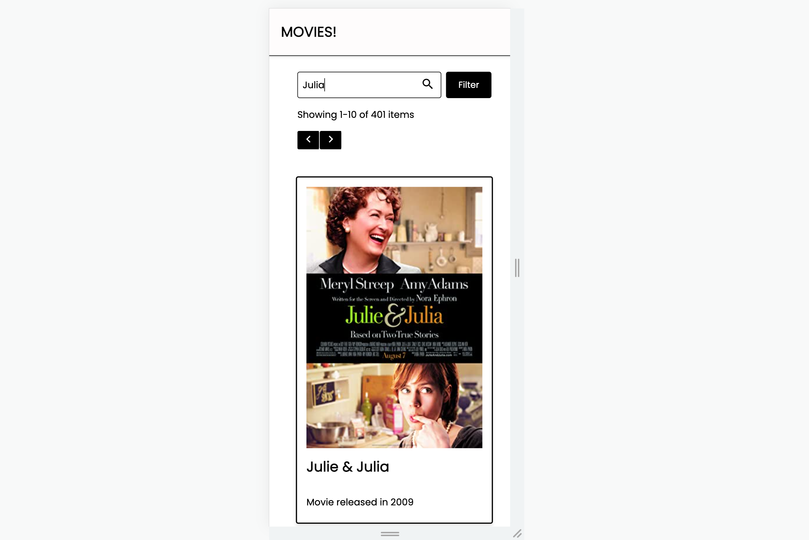

# tpt_challenge

## Table of Contents

- [Description](#description)
- [Screenshots](#screenshots)
- [Built With](#built-with)
- [Getting Started](#getting-started)
  - [Prerequisites](#prerequisites)
  - [Installation](#installation)
- [Contacts](#contacts)

## Description

Movie! app is where you can grab information about your favorite movies and find some media you didn't know existed. This application used the OMDb API to gather information and deliver it to you in a pleasing manner. It will paginate the results from OMDb, delivering 10 items at a time, and you can filter the media by type(episode, series or movie). If you find something you like, you can explore more details about the item by clicking its card in the list. This app is responsive to your mobile, or your comp screen, so check it out on either device in a web browser. Have fun!

## Screenshots
| | |
| -------------- | ----------- | 
|  |  |
||  |

## Built With
<!--  -->

## Getting Started

### Prerequisites

- [Node.js](https://nodejs.org/en/)

### Installation

1. Fork and clone the repo

2. Run 'npm install' as a terminal command.

3. In a separate tab, navigate to OMDb and follow the instructions to sign up for an API KEY - [https://www.omdbapi.com/] (https://www.omdbapi.com/)

3. After you have your key, navigate back to your repo and create a `.env` file at the root of the project. Paste this line into the file replacing {yourAPIKeyHere} with the API KEY you received from OMDb:
  PORT=3000
  REACT_APP_SERVER_URL=http://localhost:3000
  API_KEY={yourAPIKeyHere}

4.  Split the terminal and run 'npm run server' in terminal A and 'npm start' in terminal B. You can find the app at whatever localhost your npm start terminal is running on. Example -> Local:http://localhost:3002.

5. Have fun playing around!

## Contacts

  

